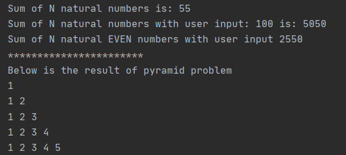

```
package RohanSingh;

import java.util.ArrayList;

/**
 * the sum of n natural number
 * the sum of even natural numbers
 * print a pyramid of numbers
 */

public class Main {
    public static void main(String[] args) {
        Main main=new Main();
        main.Sum_of_N();
        main.Sum_of_N(100);
        System.out.println("Sum of N natural EVEN numbers with user input "+main.Sum_of_even(100));
        System.out.println("***********************");
        System.out.println("Below is the result of pyramid problem");
        main.pyramid(5);


    }

    void Sum_of_N(){
        int n = 10; //n is the number of natural numbers
        int sum = 0;
        for (int i = 1; i <= n; i++) {
            sum = sum + i;
        }
        System.out.println("Sum of N natural numbers is: " + sum);


    }void Sum_of_N( int n){
        int sum = 0;
        for (int i = 1; i <= n; i++) {
            sum = sum + i;
        }
        System.out.println("Sum of N natural numbers with user input: "+n+" is: " + sum);

    }

    /**
     * complicated way
     * @param n is the user input, where it can state the number of natural numbers
     */
    int Sum_of_even(int n){

        ArrayList arrayList=new ArrayList();
        int j=0;
        while(j<=n){
            //ternary operator to check if the number is even or odd
            arrayList.add(j%2==0?j:0);//if the number is even then add it to the arraylist else add 0
            j++;


        }
        /**
         * uncomment the print statement is you want to check the contents of the arraylist
         */

//        System.out.println("Natural numbers upto: "+n+" are"+arrayList);
        int sum=0;
        for(int i=0;i<arrayList.size();i++){
            //converting arraylist.get(i) to int
            int x=(int)arrayList.get(i);
            sum=sum+x;

        }
        return sum;

    }
    void pyramid(int n){
        //n is the number of rows
        for(int i=1;i<=n;i++){
            for(int j=1;j<=i;j++){
                System.out.print(j+" ");
            }
            System.out.println();
        }

    }
}
```
